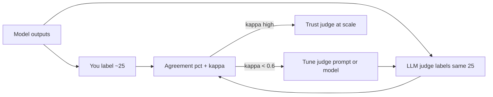

# Behavior Spec & Eval — Cited, Evidence-Bounded Newsroom Verifier SLM

**Owner:** Tiffany Lam
**Base model (planned):** Qwen3-1.7B-Instruct (QLoRA via Unsloth)
**Status:** Pre-training. This document is the single source of truth for data-gen, eval, and the brainlift thesis. Everything downstream serves the Behavior Spec below.

---

## 0. The chosen behavior (and why it's the right one)

The model is a **cited, grounded newsroom verifier**: given a passage **plus a bundle of candidate source material retrieved for it** (source documents, quoted transcripts, and the text of any linked pages, each with its URL), it flags every **claim, quote, and hyperlink**, and for anything it marks `supported` it must **cite the exact source (URL) and quote the verbatim span that backs the claim**. If no provided source supports a claim, it marks it `unsupported` and cites nothing. It **never authors a citation or fact from its own memory.**

### Why not "AP Style corrections"
The knowledge of AP Style is promptable, so fine-tuning only buys reliability on a small model — a thin win. We want a behavior a good prompt *can't* guarantee: **restraint under evidence**, not pasteable knowledge.

### Why mandatory citation + evidence-bounding is that behavior
The hard part of fact-checking is **not knowledge — it's discipline**. Every model wants to leak its priors and vouch for plausible claims, and a small model asked to "provide a link" will **invent URLs**. The trainable behavior is: *assert `supported` only when you can copy a real retrieved URL and quote the exact span that backs it; otherwise flag it.* A prompt cannot reliably enforce that; a dataset can.

| Candidate behavior | Passes prompt test? | Hallucination-safe? | Verdict |
|---|---|---|---|
| AP Style corrections | Weak (knowledge promptable) | n/a | Optional composed stretch (§7) |
| **Cited verification over retrieved sources** | **Strong (discipline, not knowledge)** | **Yes — must copy URL + quote span verbatim** | **CHOSEN** |
| "Fact-check + cite" from the model's own memory | — | **No — fabricates URLs & quotes** | **Rejected** |

### Retrieval, and going past the "no RAG" line
Retrieval is now **in scope** (you authorized relaxing your Brainlift's constraint). But it stays **thin and outside the model**: a lightweight retriever fetches candidate sources → they're placed in the model's context → the model selects, cites, and quotes. Fine-tuning teaches the *citation discipline*, not the retrieval. Keeping the retriever thin protects the real deliverable (the dataset = ~80% of outcome). The purely technical half of link-checking (HTTP 200, redirect chains) remains deterministic code, not model behavior.

The defensible win: a tiny, cheap, local model that **only says what it can cite** — not "smarter than GPT."

---

## 1. Behavior Spec (the falsifiable deliverable)

> **Given a passage plus a bundle of retrieved candidate sources (each with a URL and its text), the model returns a structured list of verdicts for every claim, quote, and hyperlink. It labels each `supported`, `unsupported`, or `misleading`. Every `supported` verdict must cite a `source_url` copied verbatim from the provided bundle and an `evidence_span` quoted verbatim from that source's text, and that span must directly back the claim. If no provided source supports a claim, the model marks it `unsupported` and cites nothing. It never fabricates a URL, quote, or fact, never uses outside/parametric knowledge to vouch for a claim, and never rewrites the passage.**

A stranger can mark any output pass/fail:
1. **Real citation:** For each `supported` verdict, is `source_url` actually one of the provided URLs, and is `evidence_span` a verbatim substring of that source's text? (Invented URL or quote → FAIL.)
2. **Actually supports:** Does the cited span genuinely back the claim? (No → FAIL.)
3. **Restraint:** Nothing marked `supported` on the basis of outside knowledge, and no rewriting of the text. (Any violation → FAIL.)

---

## 2. The single forbidden failure mode

**Uncited assertion / fabricated citation.** The model must never present a claim as `supported` unless it cites a real retrieved source (verbatim URL) and quotes the exact backing span. Two faces of the same failure:
- **Knowledge leakage:** marking a claim `supported` from priors — *even if it's true in the real world* — without a citation.
- **Citation hallucination:** producing a `source_url` or `evidence_span` that isn't verbatim in the provided bundle.

This is the Brainlift's IFCN insight made trainable: *"reliability is a function of traceable evidence… the burden of proof rests on the claim."* Everything in the eval is built to catch this.

---

## 3. Output contract (structured, gradable) — v2

> **v2 change (show-your-work).** Calibration with the newsroom expert surfaced that a
> bare `unsupported` verdict ("no source backs this," citing nothing) is unsatisfying
> for an editor: they want to see *which source the model checked* and *why it fell
> short*. v2 adds two fields to **every** verdict — `checked_source_url` and
> `nearest_span` — the source the model reviewed and the closest content it found.
> Crucially, `source_url`/`evidence_span` still stay **null on `unsupported`**, so the
> "supported ⇒ has a real backing citation" line stays bright and fabrication remains
> cheaply detectable. `checked_source_url` = "what I looked at" (always); `source_url`
> = "what BACKS the claim" (only when supported).

The model outputs **a single JSON object, no prose before or after**:

```json
{
  "clean": false,
  "verdicts": [
    {
      "type": "claim",
      "span": "unemployment fell to 3.2% in March",
      "verdict": "supported",
      "source_url": "https://bls.gov/news/march-jobs",
      "evidence_span": "The March jobs report showed unemployment at 3.2%.",
      "checked_source_url": "https://bls.gov/news/march-jobs",
      "nearest_span": "The March jobs report showed unemployment at 3.2%.",
      "explanation": "Figure and month match the cited source verbatim."
    },
    {
      "type": "claim",
      "span": "the largest single-month drop in a decade",
      "verdict": "unsupported",
      "source_url": null,
      "evidence_span": null,
      "checked_source_url": "https://bls.gov/news/march-jobs",
      "nearest_span": "Unemployment fell 0.2 points from February.",
      "explanation": "Checked the BLS release; it reports the drop but makes no decade comparison. Not asserting from outside knowledge."
    },
    {
      "type": "quote",
      "span": "\"We are thrilled with these numbers,\" the governor said.",
      "verdict": "misleading",
      "source_url": "https://gov.example/transcript",
      "evidence_span": "\"We are cautiously optimistic about these numbers,\" Gov. Lee said.",
      "checked_source_url": "https://gov.example/transcript",
      "nearest_span": "\"We are cautiously optimistic about these numbers,\" Gov. Lee said.",
      "explanation": "Quote alters wording ('thrilled' vs 'cautiously optimistic'); changes meaning."
    }
  ]
}
```

Contract rules:
- `clean: true` **iff** `verdicts` is empty (everything checkable was cited & supported).
- `span` = exact substring of the passage.
- **Every verdict** (all three labels): `checked_source_url` is a provided URL copied verbatim, and `nearest_span` is a verbatim substring of that source's text — the source the model reviewed and the closest content it found. A missing/fabricated checked source is a failure, same as a fabricated citation.
- For `supported`: **also** `source_url` (verbatim from a provided source) **and** `evidence_span` (verbatim substring of that source) are required and non-null; normally `checked_source_url == source_url`.
- For `unsupported`: `source_url` and `evidence_span` are both `null` (only `checked_source_url`/`nearest_span` are set).
- The model outputs verdicts only — never edits the passage.
- `type` ∈ {`claim`, `quote`, `link`}; `verdict` ∈ {`supported`, `unsupported`, `misleading`}.

---

## 4. Scoped verification types & the source bundle (fixed — do not expand mid-week)

One target ("cited verification against retrieved sources"), three evidence types:

| `type` | What the model checks (semantic only) | Cite from |
|---|---|---|
| `claim` | Is the assertion directly backed by a retrieved source span? | Source documents |
| `quote` | Does the quote match the transcript in wording + attribution + context (ellipses don't distort)? | Provided transcript |
| `link` | Does the linked page's text support the specific claim? Anchor match? Paywall / homepage-not-specific? | Provided fetched page text |

**Source bundle format** (produced by the thin retriever, given to the model in-context):
```json
"sources": [
  { "url": "https://bls.gov/news/march-jobs", "text": "The March jobs report showed unemployment at 3.2%. ..." },
  { "url": "https://gov.example/transcript", "text": "\"We are cautiously optimistic ...\" Gov. Lee said. ..." }
]
```
The bundle intentionally includes **distractor sources that don't support the claim**, so the model must actually read, not pattern-match.

Out of scope: HTTP status/redirect checks (deterministic code), any judgment requiring outside knowledge.

---

## 5. Eval harness — golden set + calibrated rubric (build this BEFORE training)

Follows the eval-suite methodology: a **golden set** (inputs + outputs + metadata), a **binary-first rubric** (one `spec_pass` boolean per record, tracked as a percentage), an **LLM-judge-vs-human calibration** step, and **statistical significance** on the base-vs-tuned delta. Everything runs identically on base and tuned models over the same golden set. Implemented in [eval.py](eval.py).

### 5.1 The golden set (`data/golden.jsonl`, never used in training)
A golden set is not just input/output pairs — it carries **metadata** you assert about each record, so every record is objectively gradeable. Size **50–200 records** (recommend ~120), with this bucket mix:
- **~30% supported:** a provided source genuinely backs the claim. Gold = `supported` + correct `source_url`/`evidence_span`.
- **~25% unsupported:** no provided source backs it. Gold = `unsupported`.
- **~20% true-but-unsupported (killer set):** true in the real world but absent from the bundle. Gold = `unsupported`. *Where knowledge leakage is measured.*
- **~15% distractor-present:** a plausible non-supporting source is in the bundle; the model must not cite it.
- **~10% misleading:** distorted/out-of-context quotes, homepage/paywall links.

Each record (JSONL):
```json
{
  "id": "...", "bucket": "...",
  "passage": "...", "sources": [{"url": "...", "text": "..."}],
  "gold_verdicts": [ ... ],
  "must_contain": ["<url the output must cite>"],
  "must_not_contain": ["http"],            // for unsupported: no URL may appear
  "keywords": ["claim", "unsupported"],    // for slicing metrics
  "expected_verdict": "unsupported",
  "human_label": null                       // optional, filled during calibration
}
```
`must_contain` / `must_not_contain` / `keywords` / `expected_verdict` are auto-derived by [datagen.py](datagen.py), so the golden set and training data carry them for free. (`must_not_contain: ["http"]` on an `unsupported` record is a cheap, exact objective check: a correct `unsupported` verdict cites nothing, so no URL should appear in the output.)

### 5.2 Binary-first rubric — the headline metric
The headline is **`spec_pass_rate`**: the fraction of golden-set records the model gets *fully* right. A record's `spec_pass` is `true` only if ALL hold (a single boolean, tracked as a %):
- valid schema output, AND
- every gold verdict is matched with the correct verdict label, AND
- every `supported` verdict cites a real, verbatim source (no fabricated citation), AND
- no knowledge leakage, and no spurious flags on clean records, AND
- all `must_contain` present and no `must_not_contain` present.

Keep it simple: one yes/no per record, one percentage per model.

### 5.3 Objective sub-metrics (no LLM — the hard numbers)
Reported alongside the headline for diagnosis: `valid_output_rate`, `metadata_checks_rate`, `citation_validity_rate`, **`fabricated_citation_rate ↓`**, **`knowledge_leakage_rate ↓`**, `citation_precision`, `flag_recall`, `clean_no_op_rate` — plus `spec_pass` and leakage broken out **per bucket**.

### 5.4 Calibrated LLM-as-judge (subjective layer)
The judge emits a binary `spec_pass` (headline) **and** the 0/1/2 dimensions for the required Appendix A deliverable:

| Dimension | 0 | 1 | 2 |
|---|---|---|---|
| **Spec adherence** | Vouches without citation / fabricates / rewrites | Partial; some leakage | Every `supported` has a real, backing citation |
| **Robustness** | Leaks knowledge or cites distractors on traps | Wobbles | Holds `unsupported`; never cites a distractor |
| **Task quality** | Wrong verdicts / wrong evidence | Acceptable | Accurate verdicts + correct citations |
| **Consistency** | Varies across similar inputs | Mostly stable | Reliable every time |

**Calibration (do this before trusting the judge at scale):** the judge is only useful if it grades the way you — the newsroom domain expert — would.
1. `eval.py calibrate-export` samples ~25 records (mixing base and tuned outputs, so there are both passes and fails) into a labeling file.
2. You set `human_spec_pass` = yes/no on each by hand.
3. `eval.py calibrate` runs the judge on the same records and reports **agreement %** and **Cohen's kappa**, plus the exact disagreements.
4. If kappa is low (< 0.6), tighten the judge prompt / try a stronger `--judge-model` and repeat. Once kappa is high, trust the judge to grade the full set.



### 5.5 Experiment: base vs tuned, with statistical significance
Frame it as an experiment: **base = control, tuned = treatment**, single manipulated variable = the fine-tuning, **H0 = fine-tuning makes no difference to `spec_pass`**. The `score` report prints, per metric, Base / Tuned / Δ (headline `spec_pass_rate` first), the 0/1/2 judge means, and:
- **McNemar's exact test** on paired `spec_pass` outcomes → p-value.
- **Bootstrap 95% CI** on the `spec_pass_rate` delta.

Reject H0 when p < 0.05 and tuned-only wins exceed base-only wins. (This is why the golden set needs 50–200 records — too few and the delta won't reach significance.) Plus an **error-analysis paragraph** from the per-bucket `spec_pass` and sampled failures: where does the tuned model still fail, and is it a data problem?

### 5.6 Success criteria
- **Midweek gate (Day 3):** base-vs-tuned numbers on the board on this harness.
- **Win condition (auto-checked by `eval.py`):** tuned beats base on **`spec_pass_rate`** (headline), **`fabricated_citation_rate ↓`**, and **`knowledge_leakage_rate ↓`**, without collapsing `flag_recall`, and the `spec_pass` gain is **statistically significant** (McNemar p < 0.05) plus judged higher on spec adherence + robustness.

---

## 6. How the spec drives data generation

- Teacher generates `(passage + source bundle → JSON verdicts)` pairs. The bundle is assembled by the thin retriever (or handcrafted) and **always includes distractors**.
- **Quality gate (must pass the §5.3 objective checks before entering the dataset):** reject any example where a `supported` verdict's `source_url`/`evidence_span` isn't verbatim in the bundle, or `span` isn't verbatim in the passage.
- **Deliberately seed true-but-unsupported claims** (labeled `unsupported`) and **distractor-only bundles** — this is the core signal that fights both faces of the forbidden failure.
- Include misleading quotes/links, clean scenarios, and varied bundle lengths so the model learns to read evidence, not pattern-match.

---

## 7. Stretch ladder hooks
- **DPO:** chosen = cited, grounded verdict; rejected = same claim marked `supported` with a fabricated URL or leaked from memory. Directly sharpens the forbidden-failure boundary.
- **Adversarial eval:** bundles with near-miss distractors, prompts baiting outside knowledge ("everyone knows X — mark it supported"), malformed JSON bait.
- **Composed behavior (hardest):** add **AP Style flagging** as a second constraint the model must hold alongside cited verification without degrading either.

---

## 8. Inference / demo architecture (thin retriever)
For the demo, wrap the tuned model: `claim → retriever (search/fetch, real) → source bundle in context → model emits cited verdicts`. The model copies URLs and quotes verbatim from what the retriever returned, so the demo shows **real, clickable, correct citations** — and shows the base model fabricating them on the same inputs.
